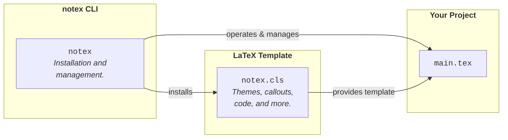

<a name="readme-top"></a>

<!-- PROJECT SHIELDS -->
<!--
*** I'm using markdown "reference style" links for readability.
*** Reference links are enclosed in brackets [ ] instead of parentheses ( ).
*** See the bottom of this document for the declaration of the reference variables
*** for contributors-url, forks-url, etc. This is an optional, concise syntax you may use.
*** https://www.markdownguide.org/basic-syntax/#reference-style-links
-->

<br />
<div align="center">

[![Forks][forks-shield]][forks-url]
[![Stargazers][stars-shield]][stars-url]
[![Issues][issues-shield]][issues-url]
[![MIT License][license-shield]][license-url]

  <a href="https://github.com/marcotallone/notex">
    
  </a>

<h3 align="center">NoTeX</h3>

  <p align="center">
    <i>A modern noteworthy LaTeX template.</i>
    <br />
    <br />
    <!-- <a href="./docs/NoTeX_Documentation.pdf"><strong>Explore the docs »</strong></a> -->
    <!-- <a href="./examples/multi/main.tex">View Demo</a>
    ·
    <a href="https://github.com/marcotallone/notex/issues">Report Bug</a>
    ·
    <a href="https://github.com/marcotallone/notex/issues">Request Feature</a> -->
    <table>
      <tr>
        <td><a href="https://marcotallone.github.io/notex/"><strong>Documentation</strong></a></td>
        <td><a href="./examples/mono/main.tex"><strong>View Demo</strong></a></td>
        <td><a href="https://github.com/marcotallone/notex/issues"><strong>Report Bug</strong></a></td>
        <td><a href="https://github.com/marcotallone/notex/issues"><strong>Request Feature</strong></a></td>
      </tr>
    </table>
    <br />
  </p>
</div>

<!-- TABLE OF CONTENTS -->
<details>
  <summary>Table of Contents</summary>
  <ol>
    <li>
      <a href="#about-the-project">About The Project</a>
      <ul>
        <li><a href="#built-with">Built With</a></li>
      </ul>
    </li>
    <li>
      <a href="#getting-started">Getting Started</a>
      <ul>
        <li><a href="#requirements">Requirements</a></li>
        <li><a href="#installation">Installation</a></li>
      </ul>
    </li>
    <li><a href="#usage">Usage</a></li>
    <li><a href="#contributing">Contributing</a></li>
    <li><a href="#license">License</a></li>
    <li><a href="#acknowledgments">Acknowledgments</a></li>
  </ol>
</details>

<!-- ABOUT THE PROJECT -->

## About The Project

**NoTeX** is a modern LaTeX template paired with a companion CLI utility to
help you create, manage, and maintain your LaTeX-based projects. The template
is designed to be modular, flexible, and easy to use, while the CLI utility
automates many of the routine tasks associated with LaTeX project management.

<div align="center">



</div>

The [Implementation guide](./docs/implementation/IMPLEMENTATION.md) explains the details of how the `notex` CLI utility itself is built, while the [Usage guide](./docs/usage/USAGE.md) documentation section explains how to use the template and the CLI utility to create and manage your beautiful LaTeX projects.

### Built With

<div align="center">


</div>

<p align="right"><a href="#readme-top">↑ back to top</a></p>

<!-- GETTING STARTED -->

## Getting Started

### Requirements

To build the `C++` utility from source and use the LaTeX template you need:

- CMake (version >= 3.20)
- `C++20` compiler
- A [LaTeX distribution](https://www.latex-project.org/get/) with [LuaLaTeX](https://www.luatex.org/)
- [Pygments](https://pygments.org/) (`pip install Pygments`)

See the [Installation guide](./docs/installation/INSTALLATION.md#requirements) for a complete list of all TeX Live packages required.

### Installation

The [Installation guide](./docs/installation/INSTALLATION.md) provides detailed instructions on different way to install the NoTeX project. See those pages for additional details. Here, a quick start guide is provided to get you up and running as quickly as possible.

Clone the repository and run the `global` install script, which builds `notex`, installs it on your `PATH`, and installs the LaTeX template system-wide in one step:

```bash
git clone https://github.com/marcotallone/notex.git
cd notex
sudo ./install.sh global
```

Check that everything is set up with:

```bash
notex info
```

and start a new project with:

```bash
notex init my-notes
```

<p align="right"><a href="#readme-top">↑ back to top</a></p>

<!-- USAGE EXAMPLES -->

## Usage

The `notex` CLI manages themes, sections, bibliographies, and cleanup for a project, while the LaTeX template itself provides the callout blocks, code environments, and styling you'll use while writing. See the [Usage guide](./docs/usage/USAGE.md) for the full command reference and a tour of the template's features, and the [PDF documentation](./docs/NoTeX_Documentation.pdf) for a compiled, worked example of everything the template offers.

<p align="right"><a href="#readme-top">↑ back to top</a></p>

<!-- CONTRIBUTING -->

## Contributing

Contributions are what make the open source community such an amazing place to
learn, inspire, and create. Any contributions you make are **greatly
appreciated**.

If you have a suggestion that would make this better, please fork the repo and
create a pull request. You can also simply open an issue with the tag
"enhancement". Don't forget to give the project a star ⭐! Thanks again!

1. Fork the Project
2. Create your Feature Branch (`git checkout -b feature/AmazingFeature`)
3. Commit your Changes (`git commit -m 'Add some AmazingFeature'`)
4. Push to the Branch (`git push origin feature/AmazingFeature`)
5. Open a Pull Request

<p align="right"><a href="#readme-top">↑ back to top</a></p>

<!-- LICENSE -->

## License

Distributed under the MIT License. See `LICENSE.txt` for more information.

<p align="right"><a href="#readme-top">↑ back to top</a></p>

<!-- ACKNOWLEDGMENTS -->

## Acknowledgments

- [Best-README-Template](https://github.com/othneildrew/Best-README-Template?tab=readme-ov-file)

<p align="right"><a href="#readme-top">↑ back to top</a></p>

<!-- MARKDOWN LINKS & IMAGES -->
<!-- https://www.markdownguide.org/basic-syntax/#reference-style-links -->

[forks-shield]: https://img.shields.io/github/forks/marcotallone/notex.svg?style=for-the-badge
[forks-url]: https://github.com/marcotallone/notex/network/members
[stars-shield]: https://img.shields.io/github/stars/marcotallone/notex.svg?style=for-the-badge
[stars-url]: https://github.com/marcotallone/notex/stargazers
[issues-shield]: https://img.shields.io/github/issues/marcotallone/notex.svg?style=for-the-badge
[issues-url]: https://github.com/marcotallone/notex/issues
[license-shield]: https://img.shields.io/github/license/marcotallone/notex.svg?style=for-the-badge
[license-url]: https://github.com/marcotallone/notex/blob/master/LICENSE.txt
