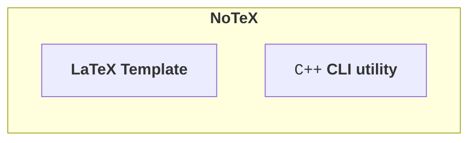

# NoTeX

**NoTeX** is a modern note-taking LaTeX template integrated with a native C++ Command Line Interface (CLI) companion utility (`notex`).

The **NoTeX framework** is composed of two main components that work synergistically to optimize writers workflow, simplify LaTeX usage and prevent end-user workspace clutter:

1. [**The LaTeX template**](../notex/latex/): A modular, globally (or locally) accessible set of document classes, layout configurations, and feature-driven LaTeX packages.

2. [**The C++ CLI utility**](../notex/include/): A compiled system binary (`notex`) that automates template installation, orchestrates project initialization, manages compilation pipelines, build artifact hygiene, and performs many other routine LaTeX tasks...

The documentation includes instructions on how to properly install and use the NoTeX CLI utility and the LaTeX template, as well as useful implementation details of the `C++` software underneath.

## Installation

See the [installation page](./installation/INSTALLATION.md) for details on how to setup and install NoTeX. 
This includes installation gudes for both the `notex` CLI utility, as well as the included LaTeX template.

## Usage

See the [usage page](./usage/USAGE.md) for complete instructions and examples on how to use the template. 
In alternative, the [quick reference page](./usage/QuickCommandsReference.md) provides a concise lookup table of the main `notex` commands and their purpose.

## Implementation

See the [implementation page](./implementation/IMPLEMENTATION.md) for additional implementation details and architectural choices. 
The `notex` CLI utility software is written entirely in `C++` and embeds the LaTeX template via CMake.

---

<b>NoTeX</b>
 

[Home](./README.md) &nbsp;•&nbsp; [Installation](./installation/INSTALLATION.md) &nbsp;•&nbsp; [Usage](./usage/USAGE.md) &nbsp;•&nbsp; [Implementation](./implementation/IMPLEMENTATION.md)

