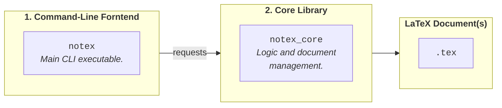
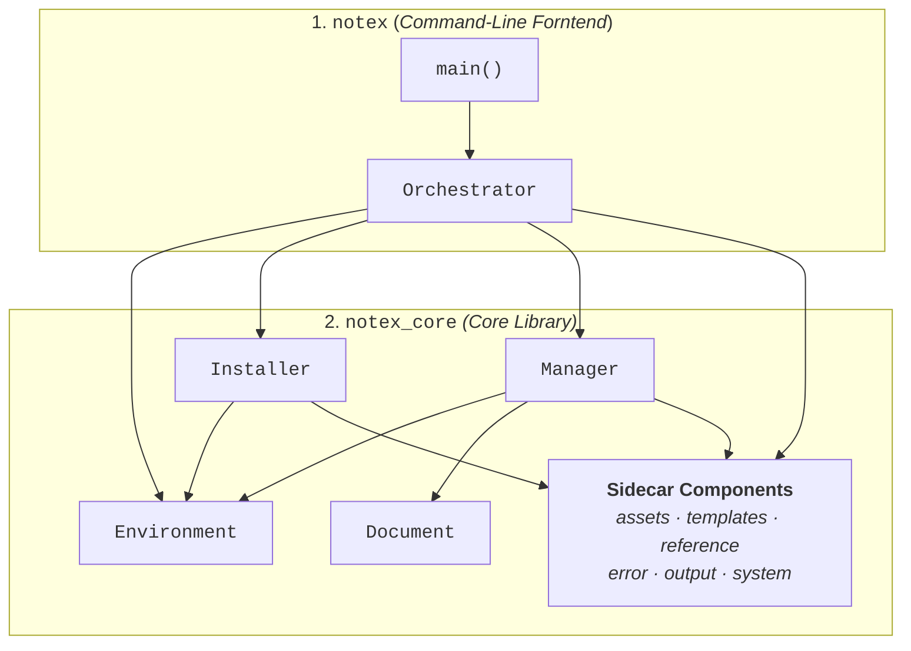
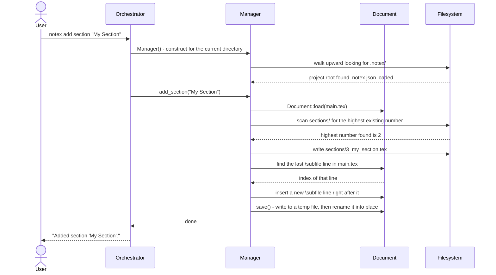

# Architecture

This page walks through how the `notex` C++ software is put together: the two layers it's split into, the five classes that do the actual work, and how a single command travels through all of them, from a keystroke on the terminal down to a modified file on disk.

## Software Structure

<div align="center">



</div>

The NoTeX C++ software is built around **five classes**, plus a series of **sidecar components** embedding useful assets, and it is deliberately organised into 2 layers, each with different responsibilities and well-divided roles:

1. The main entrypoint is a thin **command-line "frontend"**, the actual `notex` executable, whose job is to translate what the user typed on the terminal into calls on an underneath library.<br>
   This software layer is composed by the `main()` function and an `Orchestrator` class, whose role is to act as a bridge between user requests and the core library.

2. At the bottom, sits a reusable **core library**, `notex_core`, which contains the fundamental logic and handles actual `tex` files, but it is agnostic to the way it happens to be invoked.<br>
   The whole design of the library is based on 4 classes (`Installer`, `Manager`, `Environemnt` and `Document`) that interact together and use a set of shared assets to provide the requested functionalities.

The detailed diagram below shows the direction of dependencies, flowing top-to-bottom, and the various interactions between the classes in the two layers. Notice how the frontend component redirects requests via the `Orchestrator`, but the classes of the core library, each with its independent responsibility, know nothing about the frontend itself, they just perform their task as they get invoked.

<div align="center">



</div>

It's worth to keep this chart in mind while we analyze the next sections where the classes are described in more detail.

## Classes

### `Orchestrator`

> `Orchestrator`: _driving the command line_<br>
> [`orchestrator.hpp`](../../notex/include/orchestrator.hpp) | [`orchestrator.cpp`](../../notex/src/orchestrator.cpp)

The `Orchestrator` is the single entry point every `notex` command passes through. It owns the command-line parser (built on the [CLI11](https://github.com/CLIUtils/CLI11) library), registers every subcommand up front when the program starts, and keeps track of the state that needs to survive across a whole invocation, things like the global `--yes` and `--verbose` flags, or the arguments a specific subcommand was called with.

It is also the only place in the entire program that catches exceptions. Every other class is free to raise an error and simply stop, trusting that it will eventually turn into a proper message and the right exit code, because there is exactly one spot where that translation happens: inside `Orchestrator::run()`.

Beyond that, the `Orchestrator` deliberately knows nothing about how the real work gets done. It decides what needs to happen and in what order, hands the actual logic off to `Environment`, `Installer`, or `Manager`, and formats whatever comes back for the terminal. The finer points of how CLI11 is wired up, together with the full picture of error handling, live on the [CLI, Errors & Diagnostics](./CLIErrorsDiagnostic.md) page.

### `Environment`

> `Environment`: _reading the system_<br>
> [`environment.hpp`](../../notex/include/notex/environment.hpp) | [`environment.cpp`](../../notex/src/notex/environment.cpp)

`Environment` answers one question:

> _On this particular machine, where does the TeX installation expect user files to live, and has NoTeX already been installed there?_

To find out, it checks the `TEXMFHOME` environment variable first, and only falls back to asking the TeX toolchain directly (by running `kpsewhich -var-value=TEXMFHOME`) if that variable isn't set. From that resolved path, it works out where a _global_ installation's files would sit and separately checks whether the current directory already holds a _local_ one of its own. This last situation happens, in practice, whenever a `settings/notex.cls` exists in the current directory.

Implementing this functionality in a concrete class, rather than a couple of loose functions, mostly comes down to "cost". Resolving the environment can genuinely be expensive, since it might mean launching an external process.
Moreover doinf so it's often needed by commands that otherwise have nothing in common: `notex install` needs an answer before any project even exists, and `notex info` needs one purely to report on. Building an `Environment` once and querying it afterward means that cost is paid exactly once per run.

An `Environment` is also read-only by design: constructing one never writes anything to disk. That's precisely what lets commands like `notex info` and `notex checkhealth` build one freely, just to look around.

### `Installer`

> `Installer`: _deploying and removing the framework_<br>
> [`installer.hpp`](../../notex/include/notex/installer.hpp) | [`installer.cpp`](../../notex/src/notex/installer.cpp)

The main responsibility of the `Installer` class is to copy the embedded LaTeX template and fonts onto the system, and later, if required, remove the eventual installation from the system itself.

Every method of this class is `static`, which isn't just a stylistic choice. In fact, the LaTeX template is installed in a system directory and it's not a persistent state of the `Installer` class itself. Hence we don't need to preserve an istance of this class between calls.
The constructor is explicitly deleted to make that intention obvious, rather than leaving it as something nobody ever happened to call.

Where `Installer` actually writes its files, and why, is covered in more detail on the [LaTeX Template Integration](./LaTeXIntegration.md) page.

### `Manager`

> `Manager`: _operating on a project_<br>
> [`manager.hpp`](../../notex/include/notex/manager.hpp) | [`manager.cpp`](../../notex/src/notex/manager.cpp)

A `Manager` represents a single NoTeX project, concretized in the directory holding a `.notex/` folder, plus everything recorded about that project in the `.notex/notex.json` configuration file.

Nearly every command that changes something about a project ultimately runs through a `Manager`. These include tasks such as switching the theme, adding or removing a section or a bibliography, listing files, resetting or deleting the `main.tex` document, etc.

Creating an object of this class triggers project discovery process in which the `Manager` walks upward from the current directory looking for the `.notex/` directory, the same way `git` looks for `.git/`. That's what makes it possible to run a `notex` command from anywhere inside a project, not only from its root.

Given its core importance to the inner working of the NoTeX software, the `Manager` gets a full page to itself in [Project Management](./ProjectManagement.md), which covers how `.notex/notex.json` is structured (_including things it deliberately leaves out_) and exactly how sections and bibliographies get added and removed.

### `Document`

> `Document`: _editing a single file safely_<br>
> [`document.hpp`](../../notex/include/notex/document.hpp) | [`document.cpp`](../../notex/src/notex/document.cpp)

When a `Manager` operation needs to change the text of a `.tex` file, it never edits that text directly. It hands the job to a `Document` object instead. That separation keeps `Manager` focused on _what_ should happen, while `Document` is the only place in the codebase concerned with _how_ a file's lines get found, inserted, or rewritten.

Additional details about the `Document` class are also provided in the [Project Management](./ProjectManagement.md) page.
In summary, the `Document` follows a _"fail closed"_ philosophy, meaning it refuses to guess when something about a file "looks off".
In other terms, if a `Document` object is tasked with running an editing operation onto a file, but the file is missing a key landmark or a sought feature that is expected to be found, the operation simply aborts and the file is left untouched.
That's exactly what makes it safe to run `notex` commands against a file a person has also been editing by hand.

## Sidecar components

Beyond the five classes above, a handful of smaller components support them without being substantial enough to deserve a class of their own. These are the **Sidecar Components** of the `notex_core` library.

Three of them are essentially **compiled-in LaTeX data**:

- `assets` holds the embedded copy of the LaTeX template and its fonts;
- `templates` holds the files skeletons `notex init` scaffolds new projects from;
- `reference` is the table of ready-to-paste snippets behind `notex get`.

The other three:

- `errors`,
- `output`,
- `system`

are **shared infrastructure** used almost everywhere in the codebase. These implement the exception hierarchy, the styled terminal output and confirmation prompts, and the single choke point through which the library shells out to external tools or reads environment variables.

The [Embedded Assets](./EmbeddedAssets.md) page covers the first group in detail, along with how the LaTeX template ends up compiled into the binary in the first place.

## Working Example

Reading five class descriptions in isolation doesn't really show how a real command moves through them. Seeing them work together makes the picture much clearer, so here's what actually happens when the command

```bash
notex add section "My Section"
```

runs inside an existing multi-file project that already has two sections on disk. The following diagram illustrates the flow of control and the interactions between the classes, including the filesystem, from the moment the user hits Enter until the new section is added to `main.tex` and a new file is created in `sections/`.

<div align="center">



</div>

Two details in that sequence are worth calling out, since neither one shows up from the method signatures.

1. First, the next section number doesn't come from anywhere in `notex.json`. `Manager` finds it by actually looking at what's currently in the `sections/` folder and picking the next one up.
2. Second, the spot where the new `\subfile` line gets inserted isn't tracked anywhere either. `Manager` finds it by locating the _last_ `\subfile` line already present in `main.tex` and inserting right after it.

In principle, both of these could have been cached somewhere for speed. However, a project's sections can just as easily be added or deleted by hand, entirely outside of `notex`, and a cached value would have no way of noticing that had happened.
Scanning the filesystem every time means there's never a stale answer to give. [Project Management](./ProjectManagement.md) goes into this in more depth, since the same reasoning shapes the whole `.notex/notex.json` schema.

Moreover, notice that `Manager` never touches `main.tex`'s text on its own; every edit goes through `Document`. If any step along the way had failed, `Document::save()` would simply never be reached, and `main.tex` would be left exactly as it was found. The new `sections/3_my_section.tex` file might already exist on disk at that point, but that's a harmless, purely additive side effect, never a half-edited main file.

---

<div align="center">
<sub>
<b>NoTeX</b>
<br style="margin-bottom: 0.3rem;">

[Home](../README.md) &nbsp;•&nbsp; [Installation](../installation/INSTALLATION.md) &nbsp;•&nbsp; [Usage](../usage/USAGE.md) &nbsp;•&nbsp; [Implementation](./IMPLEMENTATION.md)

</sub>
</div>
