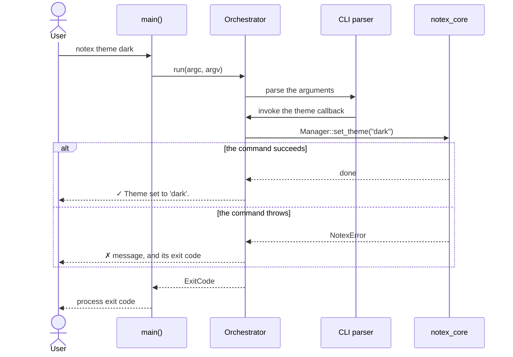

# CLI, Errors & Diagnostics

Everything on the other implementation pages happens inside the core library. This page covers the layer above it: how a command line becomes a call on that library, how a failure deep inside it becomes a message and an exit code, and what the diagnostic commands report.

The frontend is one class, supported by three of the shared [sidecar components](./Architecture.md):

> `Orchestrator`: _driving the command line_<br>
> [`orchestrator.hpp`](../../notex/include/orchestrator.hpp) | [`orchestrator.cpp`](../../notex/src/orchestrator.cpp)

> `errors` · `output` · `system`: _shared infrastructure_<br>
> [`errors.hpp`](../../notex/include/notex/errors.hpp) | [`output.hpp`](../../notex/include/notex/output.hpp) | [`system.hpp`](../../notex/include/notex/system.hpp)

## From main() to a Command

`main()` does two things: it constructs an `Orchestrator` and returns the result of `run()` as the process exit code. Every decision after that belongs either to the `Orchestrator` or to the core library.

<div align="center">



</div>

The diagram shows the single path every command takes. Parsing the arguments and invoking the right callback is handled by the [CLI11](https://github.com/CLIUtils/CLI11) library, and the callback then calls into `notex_core`. The important detail is the lower half: there is exactly one place where an exception becomes a message and an exit code, and it is `Orchestrator::run()`. Nothing in the core library ever terminates the process itself.

## Registering Commands

`register_commands()` runs once, from the constructor, and declares the entire command surface up front: the global flags, every subcommand, its options, and the callback that implements it. CLI11 invokes that callback while it parses, once it knows which subcommand was selected, so the whole of dispatch is the parser calling one lambda.

Each command's implementation lives in its own private `run_*()` method, and the state a command needs is a member variable that CLI11 writes into during parsing. The `Orchestrator` holds no domain logic of its own. Even `info` and `checkhealth`, which look like features, are compositions: they build an `Environment`, a `Manager` and an `Installer` comparison and format what those report.

Three parts of the wiring are worth explaining, because each fixes a specific problem.

**Capping subcommands.** `app_.require_subcommand(0, 1)` is set first. The lower bound of zero allows a bare `notex` to print the help text. The upper bound of one is the interesting half: without it, CLI11 chains subcommands, so a positional argument that happens to match another subcommand's name is claimed as a second subcommand instead. `notex get info` would then run `get` with no name and `info` afterwards, rather than asking for the snippet named `info`. Capping the count keeps a token that matches a subcommand name from matching once the first subcommand has claimed its positionals.

**Applying `--yes` immediately.** The `--yes` flag calls `ui::set_assume_yes(true)` through CLI11's per-token callback, which fires as the flag is parsed, rather than through the deferred callback that runs after parsing completes. A subcommand callback can display a confirmation prompt while parsing is still in progress, so a flag applied at the end would arrive too late to suppress the prompt it was meant to suppress. The `--verbose` flag is accepted as a global flag and reserved for later use; `--yes` is the one that changes behaviour today.

**Help and version as subcommands.** `notex help` and `notex version` exist alongside `--help` and `--version` for people who reach for a subcommand out of habit, and print exactly the same text. `run_version()` is trivial, but `run_help()` cannot simply call the parser's own `help()` method: by the time the callback runs, `help` is the selected subcommand, and that method would print the subcommand's own short help rather than the top-level text. It calls the formatter directly instead, which is what the parser does internally when it handles `--help`.

One command resolves an ambiguity of its own. `notex init` takes an optional project type and an optional path, in that order, so a single positional argument could be either. `run_init()` resolves it by parsing:

| Command                  | Project type | Path     |
| :----------------------- | :----------- | :------- |
| `notex init`             | `multi`      | `.`      |
| `notex init .`           | `multi`      | `.`      |
| `notex init mono`        | `mono`       | `.`      |
| `notex init notes/`      | `multi`      | `notes/` |
| `notex init mono notes/` | `mono`       | `notes/` |
| `notex init foo notes/`  | `UsageError` |          |

A lone argument is treated as the type when it parses as one and as the path otherwise, which is what makes `notex init .` and `notex init multi .` equivalent. When two arguments are given, the first must be a valid type, and anything else is a usage error rather than a silently misread path.

## Terminal Output

Nothing in the codebase writes to `std::cout` or `std::cerr` directly for user-facing messages. Everything goes through the `ui` namespace, which is also the only part of the code besides `constants.hpp` that touches ANSI escape sequences:

| Helper      | Prefix     | Stream | Used for                                      |
| :---------- | :--------- | :----- | :-------------------------------------------- |
| `success()` | green `✓`  | stdout | an operation that completed                   |
| `warning()` | yellow `!` | stdout | something skipped, cancelled, or worth noting |
| `error()`   | red `✗`    | stderr | a failure, always paired with a non-zero exit |
| `step()`    | cyan `➤`   | stdout | progress lines and section headings           |
| `info()`    | none       | stdout | plain informational lines                     |

Only `error()` writes to standard error, so redirecting standard output captures a command's results while leaving failures visible on the terminal. Snippet content from `notex get` is written with no prefix and no styling at all, which is what makes it safe to pipe:

```bash
notex get warning > snippet.tex
notex ls > project-files.txt      # failures still print to the terminal
```

Confirmation prompts go through `ui::confirm()`, which decides in three steps:

1. If `--yes` was passed, the answer is yes and nothing is printed.
2. If standard input is not an interactive terminal, the caller's default answer is used and nothing is printed.
3. Otherwise the prompt is shown, with the default indicated as `[y/N]` or `[Y/n]`, and an empty reply takes the default.

Every destructive prompt in the codebase passes `false` as its default. Taken together with step 2, that means a command run from a script, a pipeline, or a CI job declines rather than blocking forever on input that will never arrive.

> [!NOTE]
> A declined confirmation is not a failure. In a non-interactive run without `--yes`, commands such as `notex remove section 2` or `notex delete` report that they were cancelled and exit with code `0`, having changed nothing. Pass `--yes` or the command's own `--force` flag when you intend a script to go through with it.

## Errors and Exit Codes

Every exception the core library raises derives from `NotexError`, which carries both a message and the `ExitCode` the process should return. The code travels with the exception, so the site that knows what went wrong is the site that classifies it, and the frontend performs no classification of its own.

| Code | Enumerator                | Exception              | Raised when                                                   |
| ---: | :------------------------ | :--------------------- | :------------------------------------------------------------ |
|  `0` | `SUCCESS`                 |                        | The command completed, including a declined confirmation.     |
|  `1` | `FAILURE`                 | `NotexError`           | An unclassified failure, such as an external command failing. |
|  `2` | `USAGE_ERROR`             | `UsageError`           | The command line is invalid, or an argument is not accepted.  |
|  `3` | `ENVIRONMENT_ERROR`       | `EnvironmentError`     | `TEXMFHOME` could not be resolved.                            |
|  `4` | `PROJECT_NOT_FOUND_ERROR` | `ProjectNotFoundError` | No `.notex/` directory exists at or above the directory.      |
|  `5` | `FILESYSTEM_ERROR`        | `FilesystemError`      | A file could not be read, written, or renamed.                |
|  `6` | `CONFIG_ERROR`            | `ConfigError`          | `notex.json` is missing, malformed, or unwritable.            |
|  `7` | `DOCUMENT_ERROR`          | `DocumentError`        | An anchor in a `.tex` file is missing or ambiguous.           |

`Orchestrator::run()` catches three things and nothing else catches anything:

- A parse error from CLI11, which is also how the library unwinds for `--help` and `--version`. That is not necessarily a failure, so the outcome is taken from the parser's own exit handling rather than assumed.
- A `NotexError`, which reports its message and returns its own exit code.
- Any other `std::exception`, which reports its message and returns `FAILURE`.

The distinct codes are what make the tool scriptable. Exit code `4` means you are not in a project, which a wrapper script can respond to by initialising one, while `7` means a document is structured in a way the tool refuses to guess about, which needs a person:

```bash
notex checkhealth || echo "notex reported problems (exit $?)"
```

Message text is written to be actionable rather than merely descriptive. A `DocumentError` names what was being looked for and where, and a `ProjectNotFoundError` names the directory that was searched and suggests `notex init`.

## Running External Tools

`notex` shells out for two things only: resolving `TEXMFHOME` through `kpsewhich`, and refreshing the TeX filename database through `mktexlsr`. Both go through `system::run_command()`, which is the single choke point for process execution, just as `system::get_env()` is for environment variables.

The wrapper merges standard error into standard output before capturing, so a failing tool's own diagnostics end up inside the exception message instead of being discarded. A non-zero exit status or a failed spawn raises `NotexError`.

Callers decide how much that matters. `Environment` catches the failure of `kpsewhich` and falls through to its own error, which names both ways of resolving `TEXMFHOME`. `Installer` catches the failure of `mktexlsr` and downgrades it to a warning, because the files are already written and some environments simply do not ship that tool. Routing everything through one function is what makes those two policies easy to see and easy to audit.

## Diagnostics

Two commands report rather than change anything.

`notex info` prints the build metadata, then the environment, then the project. Both of the last two are optional: a machine with no resolvable TeX installation and a directory that is not a project each produce a line saying so, not an error. This is a summary, not a check, and it always exits `0`.

`notex checkhealth` is the one that draws conclusions. It runs a fixed list of checks and separates genuine failures from observations:

| Check                                                 | Failure                | Observation                   |
| :---------------------------------------------------- | :--------------------- | :---------------------------- |
| `kpsewhich` is available on `PATH`                    | not found              |                               |
| `TEXMFHOME` resolves                                  | cannot be resolved     |                               |
| An installation is detected                           | none found             |                               |
| The installation matches the embedded template        |                        | differs, so it was customised |
| Project metadata parses                               | malformed `notex.json` |                               |
| The main file exists                                  | missing                |                               |
| The recorded theme is a real theme                    | unknown theme name     |                               |
| Every section file is referenced by a `\subfile` line |                        | orphaned section files        |

A failure prints in red and makes the command exit non-zero. An observation prints as a warning and leaves the exit code alone, because neither a deliberately customised installation nor a section file you have not wired in yet is broken. Running outside a project skips the project checks entirely, which is also not a failure.

The orphan check is the visible half of the decision described in [Why sections aren't tracked](./ProjectManagement.md): since section numbering comes from `sections/` and insertion points come from the main file, comparing the two is exactly what tells you they have gone out of step.

> [!TIP]
> Run `notex checkhealth` first when a document stops compiling. A missing installation, a main file that has been renamed without updating `main_file`, and a section that was never wired in all surface there, and each one produces a different message.

Alongside the terminal output, the codebase logs internally through plog, with `PLOG_DEBUG` for flow detail such as anchor lookups and filesystem scans, and `PLOG_INFO`, `PLOG_WARNING` and `PLOG_ERROR` paired with the corresponding `ui` calls. Those calls are inert unless logging was enabled when the binary was built, in which case records go to `logs/notex.log` relative to the working directory. The [installation guide](../installation/INSTALLATION.md) lists the options that turn it on.

---

<div align="center">
<sub>
<b>NoTeX</b>
<br style="margin-bottom: 0.3rem;">

[Home](../README.md) &nbsp;•&nbsp; [Installation](../installation/INSTALLATION.md) &nbsp;•&nbsp; [Usage](../usage/USAGE.md) &nbsp;•&nbsp; [Implementation](./IMPLEMENTATION.md)

</sub>
</div>
