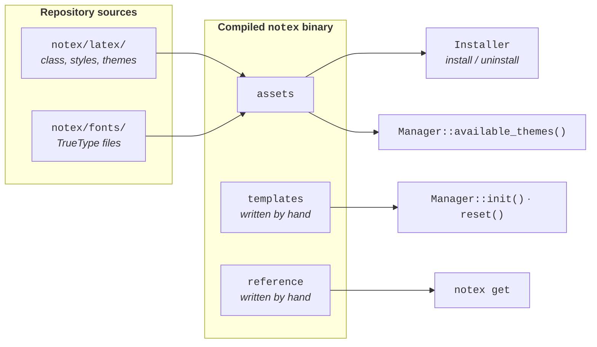

# Embedded Assets

The compiled `notex` binary carries the entire LaTeX template, every font it needs, the skeletons it scaffolds new projects from, and the snippet table it prints, all inside itself. This page explains what is compiled in, how each kind of data gets there, and what depends on it.

Three of the [sidecar components](./Architecture.md#sidecar-components) are covered here:

> `assets`: _the embedded template and fonts_<br>
> [`assets.hpp`](../../notex/include/notex/assets.hpp) | [`assets.cpp`](../../notex/src/notex/assets.cpp)

> `templates`: _the project skeletons_<br>
> [`templates.hpp`](../../notex/include/notex/templates.hpp) | [`templates.cpp`](../../notex/src/notex/templates.cpp)

> `reference`: _the snippet table_<br>
> [`reference.hpp`](../../notex/include/notex/reference.hpp) | [`reference.cpp`](../../notex/src/notex/reference.cpp)

## A Self-Contained Binary

The alternative to embedding would be to install the template files somewhere alongside the binary and copy them from there. That works until someone moves the binary, deletes the checkout it was built from, or installs it on a machine that never had the repository. A single executable with no data files beside it avoids all of that, in the same spirit that lets one `git` binary work in any directory.

Three properties follow from the decision, and they are the reason it is worth the machinery:

- `notex install` works from any directory, on any machine the binary reaches, with no reference copy of the template anywhere on disk.
- A local installation receives byte-for-byte the same files a global one would, because both are written from the same compiled-in copy.
- The embedded copy is a reliable reference to compare against, which is what makes it possible to detect a modified installation at all.

<div align="center">



</div>

The diagram shows the two different origins of compiled-in data. The template and font files are generated from the repository sources when the binary is built, while the project skeletons and the snippet table are hand-written C++ that mirrors those sources. That distinction is what the rest of this page is organised around, and it decides which of them can drift out of date.

## Template Files and Fonts

The `assets` component exposes the embedded template through four functions. `latex_files()` and `font_files()` return the whole set, and `find_latex_file()` and `find_font_file()` look one up by name. Each entry is an `EmbeddedFile`, a pair of a file name and its full contents, both of which are `std::string_view` values pointing into static storage that lives for the whole run. Nothing is copied when you ask for them.

Getting the data in there is a build-time step. A generator script reads every file directly under `notex/latex/` and `notex/fonts/` and writes C++ headers containing their contents, which `assets.cpp` is the only translation unit to include. The two directories are handled differently because their contents are different:

| Source              | Encoding                     | Why                                                                                  |
| :------------------ | :--------------------------- | :----------------------------------------------------------------------------------- |
| `notex/latex/*`     | verbatim raw string literals | Text files stay readable in the generated header and need no processing at runtime.  |
| `notex/fonts/*.ttf` | lowercase hexadecimal text   | Font files are binary, and a raw string literal cannot safely carry arbitrary bytes. |

Hex encoding doubles the size of the font data in the generated header, so it is decoded back into real bytes at runtime. That happens once, lazily, the first time `font_files()` is called, and the decoded bytes are kept in static storage for the rest of the run so that the views handed out stay valid. Text assets need none of this and are used exactly as they were generated.

> [!NOTE]
> The generator refuses to embed a text file that happens to contain the raw-string delimiter it uses. It fails the build with an explanation instead of silently truncating the file, which is the kind of corruption that would otherwise only surface much later as a LaTeX error.

Two things in the codebase treat the embedded copy as the authority rather than as a payload, and both are worth knowing about because they change how the software behaves when the template changes:

1. `Manager::available_themes()` derives the list of valid theme names by filtering embedded file names for the `notex-theme-*.tex` pattern, so the set of themes `notex theme` accepts follows the template files rather than a list in the C++ source.
2. `Installer` compares each embedded file against its counterpart on disk to decide whether an existing installation differs from what a fresh one would write. That is what drives the overwrite prompt during installation and the drift note in `notex checkhealth`, both described in [LaTeX Template Integration](./LaTeXIntegration.md).

## Project Skeletons

The `templates` component holds the files `notex init` writes: a single-file `main.tex`, a multi-file `main.tex` that references its sections through `\subfile`, a numbered section subfile, and a starter `.bib` file. These are generalised versions of the reference projects under [`examples/`](../../examples/), with no repository-specific paths or content.

Each generator fills a static template through token replacement rather than by concatenating strings. The templates are stored as raw string literals containing placeholders such as `@CLASS@`, `@SECTIONS@`, `@TITLE@` and `@NUMBER@`, which keeps them readable as LaTeX in the source file and keeps the substitution points obvious:

```cpp
// Scaffolds a multi-file main.tex for a locally installed project,
// referencing the three sections currently on disk.
const std::string main = notex::templates::multi_main(
    "settings/notex", {"1_introduction", "2_methods", "3_results"});
```

`multi_main()` takes the section stems it should reference, which is what allows `notex reset` to regenerate a main file that still points at every section, not just the first one. A fresh project simply uses the default, a single introductory section.

Section file names come from `section_stem()`, which prefixes the number and slugifies the title by lower-casing it and collapsing every run of non-alphanumeric characters into a single underscore:

| Call                                   | Result              |
| :------------------------------------- | :------------------ |
| `section_stem(1, "Introduction")`      | `1_introduction`    |
| `section_stem(2, "Linear Algebra")`    | `2_linear_algebra`  |
| `section_stem(3, "Fourier & Laplace")` | `3_fourier_laplace` |

The number lives in the file name and appears in the file's content only as a comment. That is deliberate: it is what lets `Manager` recover a project's section numbering by listing a directory, without opening a single section file. The reasoning behind that choice is on the [Project Management](./ProjectManagement.md#why-sections-arent-tracked) page.

## Snippet Table

The `reference` component is the table behind `notex get`. Each entry pairs a canonical name with ready-to-paste LaTeX and, optionally, with aliases that resolve to it. Aliases exist because the name you remember is not always the name the environment has:

```console
$ notex get box
➤ cbox
\begin{cbox}[OPTIONAL_COLOR]
    WRITE_HERE
\end{cbox}
➤ ebox
\begin{ebox}[OPTIONAL_COLOR]
    WRITE_HERE
\end{ebox}
```

`find_snippets()` resolves an alias exactly as it resolves a canonical name, and a single name may return several snippets, which is why asking for `box` prints both of the box environments instead of demanding that you already know which one you want. `snippet_names()` returns every canonical name and alias, sorted and deduplicated, and serves both the bare `notex get` listing and the suggestions offered for a name that matches nothing.

The entries mirror the environments defined in [`notex-callouts.sty`](../../notex/latex/notex-callouts.sty) and [`notex-code.sty`](../../notex/latex/notex-code.sty). Placeholders inside the snippets are written in capitals, `WRITE_HERE`, `OPTIONAL_COLOR`, `LANGUAGE`, so that anything you forgot to replace is obvious in the compiled document rather than plausible.

## Keeping Assets in Step

The three components differ in one important respect, and confusing them is the easiest mistake to make when extending the template:

| Component   | Source of truth                                            | How it gets into the binary | Stays in step                    |
| :---------- | :--------------------------------------------------------- | :-------------------------- | :------------------------------- |
| `assets`    | `notex/latex/` and `notex/fonts/`                          | generated when you build    | automatically, on the next build |
| `templates` | the reference projects under `examples/`                   | written by hand             | only when you update it          |
| `reference` | the environments in `notex-callouts.sty`, `notex-code.sty` | written by hand             | only when you update it          |

Editing, adding, or removing a file under `notex/latex/` or `notex/fonts/` regenerates the embedded copy the next time you build, so `assets` cannot silently fall behind the template. The test suite checks that guarantee directly by comparing each embedded file against the file in the repository, byte for byte, which means a stale generated header fails the tests rather than shipping.

> [!WARNING]
> `templates` and `reference` have no such safety net. If you add an environment to a style file, add its snippet to `reference` as well, and if you change the structure of the example projects, mirror the change in `templates`. Nothing will fail the build to remind you.

[Extending NoTeX](./Extending.md) walks through both of those changes, along with the other extension points the embedded data creates.

---

<div align="center">
<sub>
<b>NoTeX</b>
<br style="margin-bottom: 0.3rem;">

[Home](../README.md) &nbsp;•&nbsp; [Installation](../installation/INSTALLATION.md) &nbsp;•&nbsp; [Usage](../usage/USAGE.md) &nbsp;•&nbsp; [Implementation](./IMPLEMENTATION.md)

</sub>
</div>
