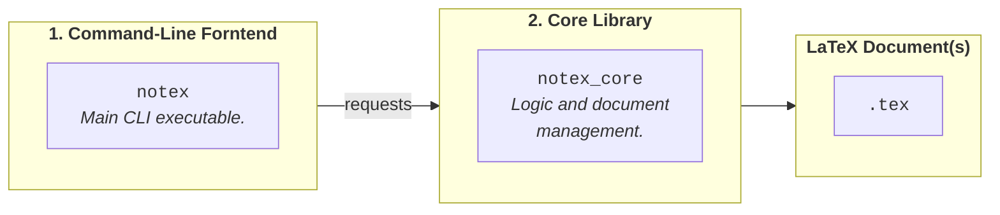

# Implementation

The following document describes the implementation details of the `notex` CLI utility, clarifying architectural choices, classes interactions and the underneath working mechanics of the software.

## Overview

The NoTeX `C++` software has the goal of simplifying LaTeX template installation, project management and workspace cleaning.
The idea behind this utility is to offer end user a versatile CLI `notex` binary that can perform various tasks and simplify the maintainance of large LaTeX-based projects.

The [usage section](../usage/USAGE.md) clearly lists all the features and the tasks that can be achieved by the `notex` binary. In this section we instead focus on the underneath implementation details.

## Architecture

The C++ software is deliberately organised into 2 layers.

1. The main entrypoint is a thin **command-line "frontend"**, the actual `notex` executable, whose job is to translate what the user typed on the terminal into calls on an underneath library.

2. At the bottom, sits a reusable **core library**, `notex_core`, which contains the fundamental logic and handles actual `tex` files, but it is agnostic to the way it happens to be invoked.

The [Architecture section](./Architecture.md) describes in more detail both the library and the frontend, presenting the five main classes and their responsibilities, as well as the dependency graph between them. It also includes a worked example tracing one command all the way through the system.

## Project Management

A NoTeX project is nothing more than a directory holding a hidden `.notex/` folder, and the software finds it the way `git` finds a repository, by walking upward from wherever the command was run. That single marker is what lets a system-wide binary know which project it is acting on, with no registry and no state kept between runs.

Inside the library, the `Manager` owns everything that is true of a project as a whole, while the `Document` owns the mechanics of changing the text of one `.tex` file. The split matters because the second one refuses to guess: an edit that cannot locate its landmark unambiguously stops rather than picking a plausible spot.

The [Project Management section](./ProjectManagement.md) covers the `.notex/notex.json` schema and what it deliberately leaves out, how sections and bibliographies are added and removed, and what `reset` and `delete` do to a project.

## Embedded Assets

The compiled `notex` binary carries the entire LaTeX template inside itself, along with its fonts, the skeletons new projects are scaffolded from, and the snippet table `notex get` prints. Nothing is read from a reference copy on disk, which is why installation works from any directory on any machine the binary reaches.

That choice pays off twice. A local installation receives exactly the same files a global one would, since both are written from the same compiled-in copy, and that copy doubles as a reference to compare an existing installation against.

The [Embedded Assets section](./EmbeddedAssets.md) covers how text and binary files are embedded differently, which of the compiled-in data is generated and which is written by hand, and what that means for keeping the two in step.

## LaTeX Template Integration

Installing the template is a matter of putting the right files in the one place a TeX distribution will look for them. Everything about the template's layout follows from how that lookup works, including the flat directory and the `notex-` prefix every fragment carries.

The `Environment` reads the system and answers where the TeX tree is and whether NoTeX is already installed, without ever writing anything. The `Installer` does the writing, in either of two modes: into the TeX tree for a global installation, or into a project's own `settings/` and `fonts/` directories for a local one, which always takes precedence.

The [LaTeX Template Integration section](./LaTeXIntegration.md) covers the TeX Directory Structure, how `TEXMFHOME` is resolved, what install and uninstall write and remove, and how a document ends up pointing at one installation or the other.

## CLI, Errors & Diagnostics

The frontend has two jobs, and they are mirror images of each other. It turns what was typed on the terminal into calls on the core library, and it turns whatever comes back, including failures raised deep inside that library, into a message and a process exit code.

The second job happens in exactly one place. Every error carries the exit code it should produce, so the code that knows what went wrong is the code that classifies it, and the single handler in `Orchestrator::run()` only has to report it.

The [CLI, Errors & Diagnostics section](./CLIErrorsDiagnostic.md) covers how commands are registered and dispatched, how terminal output and confirmation prompts behave, the full table of exit codes, and what the diagnostic commands check.

## Extending NoTeX

The boundaries between the components are drawn so that the common extensions stay small: a new theme is one file plus one line, and a new snippet is one table entry.

The [Extending section](./Extending.md) walks through those changes, along with adding a metadata key and adding a command, and states the rule that decides whether new code belongs in the core library or in the frontend.

---

<b>NoTeX</b>
 

[Home](../README.md) &nbsp;•&nbsp; [Installation](../installation/INSTALLATION.md) &nbsp;•&nbsp; [Usage](../usage/USAGE.md) &nbsp;•&nbsp; [Implementation](./IMPLEMENTATION.md)

