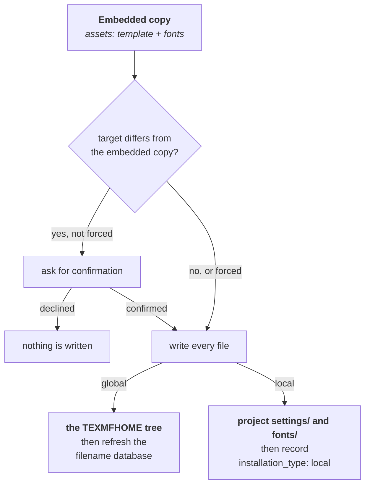

# LaTeX Template Integration

Installing the template means putting the right files in the one place a TeX distribution will look for them. This page covers where that place is, how `notex` finds it, and what the install and uninstall commands actually write and remove. It assumes you already know the commands from the [installation guide](../installation/INSTALLATION.md), and that you have a working LaTeX distribution with **LuaLaTeX**, which the template requires.

Two classes implement everything described here:

> `Environment`: _reading the system_<br>
> [`environment.hpp`](../../notex/include/notex/environment.hpp) | [`environment.cpp`](../../notex/src/notex/environment.cpp)

> `Installer`: _deploying and removing the framework_<br>
> [`installer.hpp`](../../notex/include/notex/installer.hpp) | [`installer.cpp`](../../notex/src/notex/installer.cpp)

## How TeX Finds the Template

TeX distributions locate classes, packages and fonts through a standardised directory hierarchy called the _TeX Directory Structure_ (TDS), searched by a lookup library called _kpathsea_. A file placed correctly in that hierarchy can be loaded from any document on the machine, with no relative paths involved. The user-writable branch of that hierarchy is the tree named by `TEXMFHOME`, which is where a global NoTeX installation belongs.

Two properties of that lookup shape the template's own layout.

The first is that kpathsea searches a package's directory **flat**. It resolves `\input{notex-theme-dark}` by looking for that name inside the directories it knows about, not by following a path relative to the document being compiled. A tidy `themes/` subdirectory inside the installed tree would therefore break every lookup as soon as a document was compiled from somewhere else. Every fragment of the template lives directly in one directory instead.

The second is that names in that space are global. A file called `general.tex` would collide with anything else of that name in the search path, so every fragment carries the `notex-` prefix. Only the class driver itself, `notex.cls`, and the two optional feature modules, `notex-callouts.sty` and `notex-code.sty`, are meant to be loaded by name from a document.

> [!NOTE]
> When you add a fragment to the template, prefix it with `notex-` and keep it flat in `notex/latex/`. Introducing a subdirectory works during local testing, where the document sits next to the files, and fails after a global installation.

Fonts follow from the same reasoning. The code module selects its monospace face with `\setmonofont{JetBrainsMono}` and a set of `*-Regular` style patterns, which resolves the font by file name through the same lookup. The fonts have to be deployed into the TeX tree alongside the class, which is why `notex install` writes both.

## Class Options and Themes

`notex.cls` is the driver. It declares the options it understands, forwards everything else to the `article` class it builds on, loads the selected theme, and then loads the rest of the fragments in a fixed order. Load order is not incidental: package option clashes are resolved by capturing options in the driver before any structural fragment gets a chance to load a package with conflicting settings.

The part that matters for the CLI is that **a theme is a class option, not a file the project owns**:

```tex
\documentclass[dark]{notex}
```

Each theme is one isolated `notex-theme-<name>.tex` file, and the driver inputs whichever one the option selected. Adding a theme means adding a file, with no changes to any other fragment.

This is exactly why `notex theme dark` rewrites a single line of your main file rather than touching anything inside the installed template, and why `Manager::available_themes()` can derive the valid theme names from the embedded file names. The mechanics of that rewrite are on the [Project Management](./ProjectManagement.md#anchors) page.

> [!NOTE]
> Options the class does not declare are passed through to `article`. A misspelled theme name is therefore not an error at the LaTeX level, it simply leaves the default theme in place. Going through `notex theme` avoids that, since it validates the name against the available themes before writing anything.

## Locating the TeX Tree

An `Environment` is a read-only snapshot of the surrounding system. Constructing one resolves `TEXMFHOME` and works out four directories from it, and it never writes anything to disk. That is what allows `info` and `checkhealth` to build one purely to report on it.

Resolution has two steps, in this order:

1. The `TEXMFHOME` environment variable, if it is set and not empty.
2. Otherwise, the output of `kpsewhich -var-value=TEXMFHOME`.

If neither works, the constructor raises `EnvironmentError` naming both options, since neither the variable nor the tool being missing is something the program can work around. Preferring the variable makes the choice explicit and overridable:

```bash
# Install into a throwaway tree instead of the real one.
TEXMFHOME=/tmp/texmf notex install
```

The directories derived from the result are fixed by convention:

|            | Class and style files          | Fonts                               |
| :--------- | :----------------------------- | :---------------------------------- |
| **Global** | `<TEXMFHOME>/tex/latex/notex/` | `<TEXMFHOME>/fonts/truetype/notex/` |
| **Local**  | `<project>/settings/`          | `<project>/fonts/`                  |

`TEXMFHOME` itself is typically `~/texmf` on Linux and `~/Library/texmf` on macOS. Distributions do not create it for you, so `Installer` creates every intermediate directory it needs.

Detection is then a single existence check on each side. A local installation is present when `<start_dir>/settings/notex.cls` exists, a global one when the same file exists in the global class directory, and `installation_type()` reports `LOCAL`, `GLOBAL` or `NONE`. **A local installation always wins**, matching how the class is loaded: a document that reads `\documentclass{settings/notex}` uses the project's own copy regardless of what is installed system-wide.

> [!NOTE]
> `Environment` checks the exact directory it was given and does not walk upward the way `Manager` does. Running `notex info` from `my-notes/sections/` therefore reports the global installation even when `my-notes/` holds a local one. Run it from the project root when you want the local answer.

Resolving an environment can spawn an external process, so it is built once per command and passed to whatever needs it rather than reconstructed. That cost is also the reason `Manager::init()` avoids constructing one until after it has decided what to scaffold, as described under [creating a project](./ProjectManagement.md).

## Deploying the Template

Every method on `Installer` is static. An installation is entirely described by its target directory and the embedded files, so there is no state an instance could usefully hold, and the constructor is explicitly deleted to make that intentional rather than accidental.

Both installation modes follow the same three steps: compare what is already there, write every embedded file, and record the result. What differs is the target and the last step.

<div align="center">



</div>

The diagram shows the shared decision at the top and the two targets below it. The comparison step is what makes reinstalling safe: if the files on disk already match the embedded copy exactly, nothing is at risk and no prompt appears. A prompt only appears when writing would change a file, which is the case worth pausing on, and `--force` skips it. Declining leaves the target completely untouched.

A **global** installation ends by running `mktexlsr` against `TEXMFHOME` to refresh the filename database, so that kpathsea sees the new files. Failure there is downgraded to a warning rather than propagated, since some minimal environments have no `mktexlsr` at all and the files themselves are already correctly in place.

> [!WARNING]
> If that warning appears, the installation is on disk but TeX may not find it yet. Refresh the database yourself and confirm with `kpsewhich notex.cls`, which prints the resolved path when the lookup succeeds and nothing when it does not.

A **local** installation ends by recording `installation_type: "local"` in `<target>/.notex/notex.json`, creating the `.notex/` directory if the target is not a project yet and preserving the existing configuration if it is. That is the one case where the installer touches project metadata, and it goes through `Manager::write_config()` rather than writing JSON of its own.

The comparison itself is exposed as `installation_differs()`, which `notex checkhealth` reuses to report drift without installing anything. It answers one specific question: would installing change any file that NoTeX owns? A file you added yourself to `settings/`, such as an extra fragment, is not drift and is never reported, because only the embedded files are compared. A target directory that does not exist at all reports no difference, since there is nothing there to overwrite.

> [!TIP]
> Drift is expected, and useful, if you installed locally in order to customise the template. `checkhealth` reports it as an informational warning rather than a failure, so a customised local install still passes.

## Removing an Installation

`notex uninstall`, and its alias `notex prune`, mirror the installation exactly. The global form removes the two directories inside the TeX tree and refreshes the filename database, downgrading a `mktexlsr` failure the same way. The local form removes `<project>/settings/` and `<project>/fonts/`, then clears `installation_type` in the project metadata rather than leaving a stale record behind.

Both forms confirm first, unless `--force` is given, and both delete **only the directories an installation would have written**. Your documents, sections and bibliography are never involved.

> [!CAUTION]
> A local uninstall removes `settings/` in full, including any changes you made to the template there. If you customised a local installation, keep it under version control or copy the changed files elsewhere before uninstalling.

## Choosing the Class Path

Which of the two forms a document should use depends on where the template lives:

| Installation | Class line                                | Files loaded from             |
| :----------- | :---------------------------------------- | :---------------------------- |
| Global       | `\documentclass[OPTIONS]{notex}`          | the `TEXMFHOME` tree          |
| Local        | `\documentclass[OPTIONS]{settings/notex}` | the project's own `settings/` |

`notex init` picks the right one when it scaffolds a project, and `notex reset` picks it again when it regenerates the main file. Both decide by checking for `settings/notex.cls` in the target directory, so the answer reflects the state of the project at that moment.

This is a one-time decision, written into a line of text. Installing the template locally into a project that already has a `main.tex` does not rewrite that file, so a document scaffolded against a global installation keeps loading the global one:

```bash
notex install .    # writes settings/ and fonts/
# main.tex still reads \documentclass{notex}
```

To switch, edit the `\documentclass` line yourself, or run `notex reset` and let it regenerate the file from the template. Reset replaces the whole main file and keeps a backup, so read [the reset section](./ProjectManagement.md) before choosing that route.

---

<div align="center">
<sub>
<b>NoTeX</b>
<br style="margin-bottom: 0.3rem;">

[Home](../README.md) &nbsp;•&nbsp; [Installation](../installation/INSTALLATION.md) &nbsp;•&nbsp; [Usage](../usage/USAGE.md) &nbsp;•&nbsp; [Implementation](./IMPLEMENTATION.md)

</sub>
</div>
