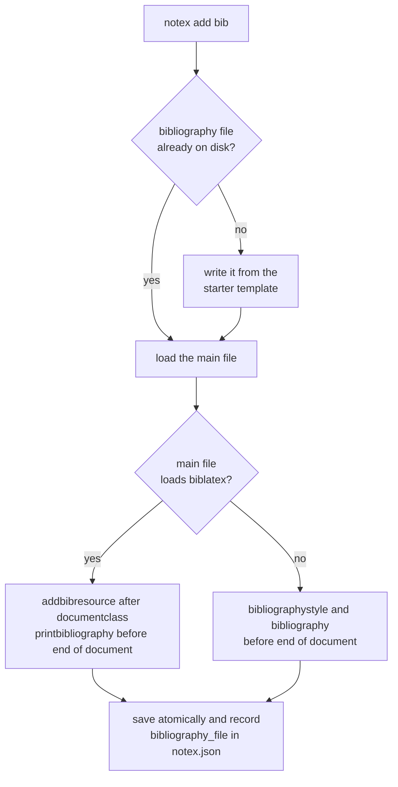

# Project Management

This page describes how `notex` recognises a project, what it records about one, and how the commands that change your files carry out their edits. It assumes you have read the [Architecture](./Architecture.md) page and already know the commands themselves from the [usage guide](../usage/USAGE.md).

Two components do all the work described here. The `Manager` owns everything that is true of a project as a whole, and the `Document` owns the mechanics of changing the text of one `.tex` file.

> `Manager`: _operating on a project_<br>
> [`manager.hpp`](../../notex/include/notex/manager.hpp) | [`manager.cpp`](../../notex/src/notex/manager.cpp)

> `Document`: _editing a single file safely_<br>
> [`document.hpp`](../../notex/include/notex/document.hpp) | [`document.cpp`](../../notex/src/notex/document.cpp)

## What Makes a Project

A directory is a NoTeX project when it contains a hidden `.notex/` directory holding a `notex.json` file. Nothing else marks it. There is no registry of known projects anywhere on the system, and the binary itself stores no state between runs.

Because the marker lives in the project rather than in the binary, `notex` can find its way around the same way `git` does. `Manager::find_project_root()` takes a starting directory, makes it absolute, and walks upward one parent at a time until it finds a `.notex/` directory or reaches the filesystem root. Constructing a `Manager` runs that search and then loads `.notex/notex.json` into a `ProjectConfig`. A project that cannot be found raises `ProjectNotFoundError`, and metadata that cannot be parsed raises `ConfigError`.

The practical consequence is that every project command works from anywhere inside the project, not only from its root:

```bash
cd my-notes/sections
notex add section "Fourier Transform"   # still edits my-notes/main.tex
```

> [!NOTE]
> The search stops at the _first_ `.notex/` directory it meets on the way up. If you nest one project inside another, commands run in the inner directory always act on the inner project, and the outer one is never consulted.

Not every command needs a project. `install`, `init`, `get` and `clean` operate on a path you give them, and `info` and `checkhealth` treat a missing project as one more thing to report rather than as a failure. `find_project_root()` is public and static precisely so those commands can ask whether they are inside a project without having to construct a `Manager` and catch an exception. `notex clean` uses it to print a notice before cleaning a directory that happens to sit outside any project.

## Project Metadata

`.notex/notex.json` is a small, versioned document. A freshly initialised multi-file project looks like this:

```json
{
  "bibliography_file": "",
  "installation_type": "",
  "main_file": "main.tex",
  "notex_version": "1.0.0",
  "project_type": "multi",
  "schema_version": 1,
  "theme": ""
}
```

Each field maps onto one member of `ProjectConfig`:

| Field               | Value                         | Written by                           | Meaning                                                 |
| :------------------ | :---------------------------- | :----------------------------------- | :------------------------------------------------------ |
| `schema_version`    | integer, currently `1`        | `init`                               | On-disk format version, so the schema can grow safely.  |
| `notex_version`     | version string                | `init`                               | The `notex` version that created the project.           |
| `project_type`      | `"mono"` or `"multi"`         | `init`                               | Single-file or multi-file layout.                       |
| `main_file`         | file name, default `main.tex` | `init`, `set`                        | The entry `.tex` file every mutation resolves against.  |
| `installation_type` | `"local"` or empty            | `install <path>`, `uninstall <path>` | Records that the project carries its own template copy. |
| `theme`             | theme name                    | `theme`, `set`                       | The theme last selected through `notex theme`.          |
| `bibliography_file` | file name                     | `add bib`, `remove bib`, `set`       | The `.bib` file wired into the main file.               |

Fields that nothing has populated yet are stored as empty strings rather than omitted. That keeps the shape of the file constant over a project's lifetime, so a reader never has to distinguish "absent" from "not set yet". Loading is forgiving in the other direction as well: a missing key falls back to its default instead of failing, which means an older `notex.json`, or one you have trimmed by hand, still loads.

> [!NOTE]
> `installation_type` is a note about how the project was set up, not the authoritative answer to where the template lives. Only a local install writes it, and `info` and `checkhealth` report the installation they actually detect on disk through `Environment`. See [LaTeX Template Integration](./LaTeXIntegration.md) for how that detection works.

### Why Sections Aren't Tracked

One thing is deliberately missing from the schema: the list of a project's sections. It would be easy to record, and it would be wrong almost immediately.

Sections are ordinary files. You can add one with a text editor, delete one with `rm`, or move one in from another project, all without `notex` being involved. Any list stored in `notex.json` would then describe a project that no longer exists, and the next command would act on that stale picture.

Instead, the two facts a section operation needs are derived at the moment they are needed, from two independent places:

1. **The next section number** comes from scanning `sections/` for files named `<number>_<slug>.tex` and taking the highest number found, plus one.
2. **The insertion point** for a new `\subfile` line comes from the main file itself, by locating the last `\subfile{sections/...}` line already present.

Keeping these separate matters. A section file you added by hand is numbered correctly because the number comes from the directory, and a main file you reorganised by hand keeps its structure because the insertion point comes from the document. Neither mechanism can contradict the other, because neither one is a cached copy of anything.

The cost is a directory scan per command, which is negligible next to the cost of being wrong. The benefit shows up in `notex checkhealth`, which compares the two sources and reports section files that no `\subfile` line references. That check is described on the [diagnostics page](./CLIErrorsDiagnostic.md#diagnostics).

> [!WARNING]
> Editing `notex.json` does not restructure your document. `notex set theme dark` rewrites the recorded value and nothing else, while `notex theme dark` rewrites the `\documentclass` line _and_ the metadata. Use `set` to correct a stale record, not to change the document.

## Creating a Project

`Manager::init()` scaffolds a new project and returns a `Manager` for it. It refuses to run when `main.tex` or `.notex/` already exists, unless you pass `--force`, so an accidental `notex init` in a directory you have already been working in raises `FilesystemError` instead of overwriting your work.

A single-file project gets one `main.tex`. A multi-file project gets a `main.tex` that loads `subfiles` and one introductory section:

```plaintext
my-notes/
├── .notex/
│   └── notex.json
├── main.tex
└── sections/
    └── 1_introduction.tex
```

Both skeletons come from the compiled-in [`templates`](./EmbeddedAssets.md#project-skeletons) component, which fills the `\documentclass` argument in from a `class_path` value that `init` resolves first.

That resolution is more careful than it looks. It checks the filesystem directly for `<target_dir>/settings/notex.cls` and, if the file is there, uses `settings/notex`. Only afterwards does it construct an `Environment`, inside a `try`/`catch`, purely to decide whether to warn you. The order matters because an `Environment` always resolves `TEXMFHOME` when it is built, and throws if it cannot. Asking it first would make `notex init` fail outright on a machine with no TeX installation at all, which is exactly the machine on which you might reasonably scaffold a project to compile later.

> [!TIP]
> Scaffold first, then install locally. Running `notex install .` before `notex init .` creates `.notex/` as part of recording the local installation, which then makes `init` treat the directory as an existing project and refuse to scaffold it without `--force`.

## Editing Documents Safely

No `Manager` operation edits `.tex` text on its own. Each one loads the file through `Document::load()`, which reads it into a plain sequence of lines, applies its changes to that sequence, and calls `save()`. The split keeps `Manager` concerned with what should change and leaves `Document` as the only place that knows how a line is found, inserted, or rewritten.

### Anchors

An _anchor_ is a recognisable landmark line that an edit positions itself against, such as the `\documentclass` line or `\end{document}`. `Document` offers three ways to look one up, and the difference between them is the whole safety model:

| Primitive       | Matches                | On no match     | On several matches |
| :-------------- | :--------------------- | :-------------- | :----------------- |
| `find_all()`    | every matching line    | empty result    | all of them        |
| `find_unique()` | exactly one line       | `DocumentError` | `DocumentError`    |
| `find_last()`   | the last matching line | `std::nullopt`  | takes the last one |

`find_unique()` is used wherever an ambiguous answer would mean guessing. If a document contains two `\end{document}` lines, there is no defensible way to choose one, so the operation stops and the file is left untouched. The error message names what was being looked for, which turns a failed command into a usable report:

```console
$ notex add section "Results"
✗ found 2 lines matching a unique \end{document} line in 'main.tex',
  expected exactly one; please resolve the ambiguity by hand.
```

This is the _fail closed_ behaviour referred to throughout the documentation. Refusing to act is the correct outcome whenever the document does not look the way the operation expects, because the alternative is a silent edit in the wrong place.

Predicates test the line with its surrounding whitespace stripped, so indentation is irrelevant, but a commented-out command is not an anchor. A line reading `% \end{document}` starts with a comment character and matches nothing.

Rewriting the class options works on the same principle. `set_documentclass_option()` locates the unique `\documentclass` line, parses whatever sits between `[` and `]`, removes every option belonging to the mutually exclusive group it was given, and puts the new one at the front. Everything else on the line survives:

```tex
% before: notex theme dark
\documentclass[light, nocode]{notex}

% after
\documentclass[dark, nocode]{notex}
```

The group passed in for a theme switch is the list of available theme names, which `Manager::available_themes()` derives from the embedded template files rather than from a hardcoded list. Adding a theme file to the template is therefore enough for `notex theme` to accept its name, as described in [Embedded Assets](./EmbeddedAssets.md#template-files-and-fonts).

### Atomic Writes

`save()` never writes over the original file directly. It writes the full contents to `<path>.notex.tmp` and then renames that file over the original. A rename within one filesystem either happens completely or not at all, so a reader of `main.tex` sees either the old document or the new one, never a truncated mixture. If the temporary file cannot be written, or the rename fails, the temporary file is removed and a `FilesystemError` is raised with the original still intact.

Because changes only reach disk at `save()`, an operation that raises partway through leaves the document exactly as it was found. There is one deliberate exception, which is worth knowing about: `add_section()` writes the new section file _before_ editing the main file, so a failure at the insertion step can leave a section file on disk that nothing references. That is purely additive and harmless, and `notex checkhealth` reports it as an orphan.

## Sections and Bibliography

The section commands behave differently in the two project types, because the two layouts express a section differently.

| Command                       | Single-file project                                            | Multi-file project                                                                          |
| :---------------------------- | :------------------------------------------------------------- | :------------------------------------------------------------------------------------------ |
| `notex add section "<title>"` | Inserts a `\section{<title>}` heading before `\end{document}`. | Writes `sections/<N>_<slug>.tex` and inserts a `\subfile` line after the last existing one. |
| `notex remove section <N>`    | Raises `UsageError`.                                           | Deletes the section file and its `\subfile` line, after confirmation.                       |

Removing a section is refused in a single-file project because there is no unambiguous body to remove: section content there is just text in the middle of `main.tex`. In a multi-file project the operation confirms first, then tolerates a missing `\subfile` line with a warning while treating several lines pointing at the same section as an error, on the same reasoning as any other ambiguous anchor.

> [!NOTE]
> Section numbers are never renumbered. Removing section 2 of 3 leaves files numbered 1 and 3, and the next `add section` becomes number 4, since numbering continues from the highest number present. If you want a contiguous sequence, rename the files yourself and fix the `\subfile` lines to match.

The bibliography commands adapt to the document instead of assuming one style. `add_bibliography()` inspects the main file for a `\usepackage` line loading `biblatex` and chooses accordingly:

<div align="center">



</div>

The diagram shows the two branches of `notex add bib`. The `.bib` file is created from the starter template only if it is not already there, so an existing bibliography is never overwritten. The commands are then inserted only if an equivalent line is not already present, which makes the whole command idempotent: running `notex add bib` twice changes nothing the second time.

`remove_bibliography()` is deliberately asymmetric. It strips all four kinds of bibliography command unconditionally, since re-adding them costs one command, and asks for confirmation only before the single step that cannot be undone, deleting the `.bib` file itself.

> [!NOTE]
> The `bibliography_file` record is cleared whether or not you keep the file. If you decline the deletion, the `.bib` file stays on disk but `notex ls` stops listing it, because `ls` reports the bibliography the project _records_, not every `.bib` file it finds.

## Cleaning Artefacts

`Manager::clean()` is static and takes a path, because cleaning is about a directory and needs no project at all. It walks the directory recursively and matches two kinds of artefact.

Files are matched by filename **suffix**, not by extension. Several LaTeX artefacts, `.synctex.gz` and `-blx.bib` among them, are not extensions in the sense the filesystem library means, and an extension-based check would miss them entirely. Directories are matched by name prefix, because the `minted` package always names its cache directory `_minted-<jobname>` regardless of what your files are called. A matched directory is removed whole and the walk does not descend into it.

The result is a `CleanReport` listing every file and directory removed, which is what lets the command print each path rather than only a count. Under `--dry-run` nothing is deleted and the report describes what would have been:

```bash
notex clean --dry-run    # inspect first
notex clean              # then remove
```

A path that does not exist, or is not a directory, produces an empty report rather than an error, so the command behaves the same way whether or not it happens to be run inside a project.

## Resetting and Deleting

Two commands undo work rather than adding to it, and both ask for confirmation unless you pass `--force`.

`notex reset` regenerates the main file from the template. It copies the current one to `<main_file>.bak` first, overwriting any earlier backup, then writes a fresh skeleton. For a multi-file project the regenerated file references **every** section currently present under `sections/`, in number order, so a reset after several `add section` calls does not silently drop all but the first. Sections and the bibliography file themselves are never touched.

> [!CAUTION]
> A reset replaces the whole main file, so your preamble customisations, title block and any bibliography commands are gone from it. The previous version survives only as `<main_file>.bak`. After a reset, run `notex add bib` again to rewire an existing bibliography.

`notex delete` removes NoTeX's own scaffolding: `.notex/`, `settings/`, `fonts/`, and build artefacts by way of `clean()`. Your main file, `sections/` and bibliography are kept. Passing `--all` instead removes the entire project directory.

> [!CAUTION]
> `notex delete --all` deletes every file in the project root, including documents `notex` never created. There is no backup and no dry run for it.

After a plain `notex delete` the directory is no longer a project, and a locally installed template is gone along with `settings/`. If your `main.tex` reads `\documentclass{settings/notex}` it will no longer compile until you reinstall the template locally or point the class at a global installation. [Choosing the class path](./LaTeXIntegration.md) covers both options.

---

<div align="center">
<sub>
<b>NoTeX</b>
<br style="margin-bottom: 0.3rem;">

[Home](../README.md) &nbsp;•&nbsp; [Installation](../installation/INSTALLATION.md) &nbsp;•&nbsp; [Usage](../usage/USAGE.md) &nbsp;•&nbsp; [Implementation](./IMPLEMENTATION.md)

</sub>
</div>
